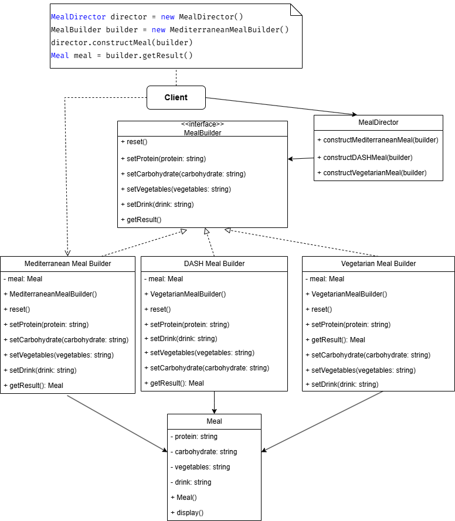

# Yêu Cầu Thiết Kế Hệ Thống Quản Lý Chế Độ Ăn Uống

## Mô Tả

Bạn được yêu cầu thiết kế một hệ thống quản lý các chế độ ăn uống khác nhau, bao gồm các chế độ ăn như **Địa Trung Hải**, **DASH**, và **Chế độ ăn chay**. Mỗi chế độ ăn sẽ có các thành phần cụ thể như **protein, carbohydrate, rau củ quả, và đồ uống**, được kết hợp linh hoạt theo các đặc điểm của từng chế độ ăn uống.

## Yêu Cầu

-   **Sử dụng Builder Pattern** để thiết kế hệ thống cho phép người dùng chọn các thành phần cho từng chế độ ăn.
-   Mỗi chế độ ăn phải bao gồm ít nhất:
    -   **Một nguồn Protein**
    -   **Một nguồn Carbohydrate**
    -   **Ít nhất một loại Rau củ quả**
-   Hỗ trợ các chế độ ăn phổ biến:
    -   **Chế độ ăn Địa Trung Hải**: Thịt cá, dầu ô liu, rau quả tươi, rượu vang đỏ.
    -   **Chế độ ăn DASH**: Thịt gà, gạo lứt, rau xanh, nước ép trái cây.
    -   **Chế độ ăn chay**: Đậu hũ, khoai tây, rau củ hỗn hợp, nước lọc.
-   **Triển khai Builder Pattern** để dễ dàng xây dựng các chế độ ăn khác nhau mà không cần thay đổi mã nguồn hiện có.

## Class Diagram - Hệ Thống Quản Lý Chế Độ Ăn Uống

Sơ đồ trên mô tả hệ thống quản lý chế độ ăn uống sử dụng **Builder Pattern**.

-   **MealBuilder (Interface)**: Định nghĩa các phương thức để thiết lập từng thành phần của bữa ăn.
-   **Concrete Builders** (`MediterraneanMealBuilder`, `DASHMealBuilder`, `VegetarianMealBuilder`): Triển khai `MealBuilder` để xây dựng các bữa ăn theo chế độ tương ứng.
-   **MealDirector**: Điều phối quá trình xây dựng bữa ăn bằng cách gọi các phương thức của `MealBuilder`.
-   **Meal**: Đối tượng chứa thông tin về bữa ăn hoàn chỉnh (Protein, Carbohydrate, Rau củ, Đồ uống).
-   **Client**: Gọi `MealDirector` và `MealBuilder` để tạo một bữa ăn theo chế độ mong muốn.
