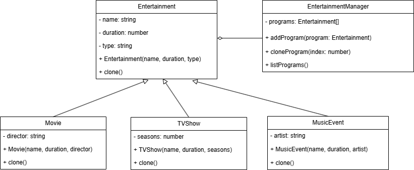

# Đề Bài: Thiết Kế Hệ Thống Quản Lý Chương Trình Giải Trí

## Mô Tả

Bạn được yêu cầu thiết kế một hệ thống quản lý các chương trình giải trí như **Phim**, **Chương trình truyền hình**, và **Sự kiện âm nhạc**. Hệ thống cần có khả năng tạo ra các bản sao của các chương trình giải trí đã tồn tại, cho phép nhân bản các chương trình mà không cần phải tạo ra từ đầu.

## Yêu Cầu

-   Sử dụng **Prototype Pattern** để thiết kế hệ thống, cho phép nhân bản các đối tượng thuộc loại chương trình giải trí khác nhau.
-   Hệ thống cần hỗ trợ việc sao chép các đối tượng như **Phim**, **Chương trình truyền hình**, và **Sự kiện âm nhạc** với đầy đủ thông tin ban đầu.
-   Mỗi chương trình giải trí cần có khả năng tùy chỉnh các thuộc tính riêng như:
    -   **Tên chương trình**
    -   **Thời lượng**
    -   **Loại hình giải trí**

## Class Diagram - Hệ Thống Quản Lý Chương Trình Giải Trí

Sơ đồ trên mô tả hệ thống quản lý chương trình giải trí sử dụng **Prototype Pattern**.

-   **Entertainment (Abstract Class)**: Lớp cha định nghĩa các thuộc tính cơ bản và phương thức `clone()` để sao chép đối tượng.
-   **Concrete Classes** (`Movie`, `TVShow`, `MusicEvent`): Kế thừa từ `Entertainment` và triển khai phương thức `clone()` để nhân bản đối tượng.
-   **EntertainmentManager**: Quản lý danh sách chương trình giải trí, cho phép thêm mới, nhân bản và hiển thị danh sách.
-   **Client**: Tạo các chương trình giải trí ban đầu, lưu trữ vào `EntertainmentManager`, và thực hiện nhân bản khi cần.
