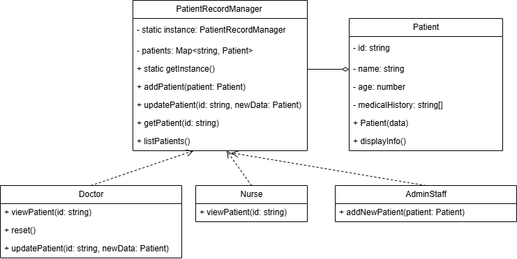

# Đề Bài: Thiết Kế Hệ Thống Quản Lý Hồ Sơ Bệnh Nhân

## Mô Tả

Bạn được yêu cầu thiết kế một hệ thống quản lý hồ sơ bệnh nhân sử dụng **Singleton Pattern**. Hệ thống phải đảm bảo rằng có một nơi lưu trữ và quản lý tất cả hồ sơ bệnh nhân duy nhất trên toàn hệ thống. Điều này giúp duy trì **tính nhất quán** và **tránh trùng lặp hoặc mất dữ liệu** khi các bác sĩ hoặc nhân viên y tế truy cập vào hồ sơ của bệnh nhân.

## Yêu Cầu

-   Sử dụng **Singleton Pattern** để thiết kế lớp quản lý hồ sơ bệnh nhân, đảm bảo **chỉ có một thể hiện duy nhất** của hệ thống quản lý này.
-   Cung cấp các phương thức để:
    -   **Thêm mới** hồ sơ bệnh nhân.
    -   **Cập nhật** thông tin bệnh nhân.
    -   **Truy vấn** hồ sơ bệnh nhân.
-   Hệ thống cần hỗ trợ **truy cập thông tin bệnh nhân từ nhiều nơi khác nhau** (ví dụ: từ bác sĩ, y tá, nhân viên hành chính) nhưng vẫn đảm bảo **tính nhất quán của dữ liệu**.

## Class Diagram - Hệ Thống Quản Lý Hồ Sơ Bệnh Nhân

Sơ đồ trên mô tả hệ thống quản lý hồ sơ bệnh nhân sử dụng **Singleton Pattern**.

-   **Patient**: Đại diện cho một bệnh nhân với các thông tin như ID, tên, tuổi, và lịch sử bệnh án.
-   **PatientRecordManager (Singleton)**: Lớp duy nhất quản lý toàn bộ hồ sơ bệnh nhân, đảm bảo chỉ có một thể hiện duy nhất trên toàn hệ thống.
-   **Doctor**: Có quyền truy vấn và cập nhật hồ sơ bệnh nhân.
-   **Nurse**: Chỉ có quyền xem thông tin bệnh nhân nhưng không thể chỉnh sửa.
-   **AdminStaff**: Có quyền thêm bệnh nhân mới vào hệ thống.
-   **Client**: Đại diện cho người sử dụng hệ thống, có thể là bác sĩ, y tá hoặc nhân viên hành chính thực hiện các thao tác trên hồ sơ bệnh nhân.
